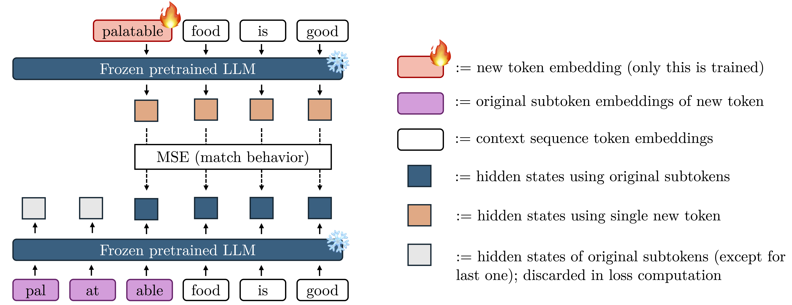

# Token Distillation: Attention-aware Input Embeddings for New Tokens

Official code release for the paper “Token Distillation: Attention-aware Input Embeddings for New Tokens” ([arXiv:2505.20133](https://arxiv.org/abs/2505.20133)).



## Overview

Token Distillation finds input embeddings for new tokens by **distilling hidden states obtained with the original tokenization into a single embedding**. This solves a _fundamental limitation_ of many previous "heuristic" embedding initialization methods, which only find (clever) ways to compute a weighted sum of existing embedding vectors: representations for words which do not cleanly map to a single token are not stored in the embedding tables at all -- but rather constructed during the forward pass in the (early) Transformer layers.

In the paper, we run extensive experiments and find that Token Distillation outperforms heuristic embedding initialization methods as well as strong baselines such as pretrained embedding prediction hyper-networks and embedding optimization via the next-token prediction objective. **Note:** Token Distillation learns _input embeddings_. For output embeddings, we do implement learning them via next-token prediction but you could freely combine Token Distillation with other methods.

## Quickstart

We manage dependencies using [`uv`](https://docs.astral.sh/uv/). To create a local environment and install the dependencies, run:

```bash
uv sync --frozen
```

Run end-to-end token distillation from the command line using our [example script](./example.py):

```bash
python example.py \
    --model_path meta-llama/Llama-3.1-8B-Instruct \
    --new_tokens " Krankenwagen, Schmetterling" \
    --out_path outputs/llama3.1-german \
    --dataset_path HuggingFaceFW/fineweb-2 \
    --dataset_name "deu_Latn" \
    --dataset_split train \
    --snippet_len 50 \
    --snippets_per_token 100 \
    --learning_rate 1e-4 \
    --epochs 1
```

This command will:

1. Add the `new_tokens` if needed. For example, the command above will add `ĠKrankenwagen` (German for ambulance) and `ĠSchmetterling` (German for butterfly). `Ġ` represents a whitespace in the added tokens.
2. Mine candidate contexts from the dataset.
3. Run Token Distillation to learn embeddings for the new tokens.
4. Save the updated tokenizer/model artifacts to `outputs/llama3.1-german`.

## Python API

We provide an implementation of Token Distillation that can be installed as a python package in [`token_distillation/`](./token_distillation/).

> ℹ️ A PyPI release is planned. Until then, you can just copy-paste the [`token_distillation/`](./token_distillation/) folder into your project and install from source (`pip install -e ./token_distillation` or as shown in our top-level [`pyproject.toml`](pyproject.toml)).

First, create the `TokenDistillation` class:

```python
from token_distillation import TokenDistillation

tokdist = TokenDistillation(model_path="meta-llama/Llama-3.1-8B-Instruct", attn_impl="sdpa", device="cuda:0")
```

Then, you can run Token Distillation like this:

```python
from token_distillation import GeneratedDataSource

model, tokenizer = tokdist.run(
        new_tokens=[" Krankenwagen", " Schmetterling"],
        data=GeneratedDataSource(seed=42),
        out_path="outputs/llama3.1-german"
        save=True # `save=True` saves the model & tokenizer in `out_path`
)
```

The above uses _generated snippets_ from the model itself during the embedding optimization process. This can be nice as you do not need to provide a corpus from which to retrieve relevant samples for the new tokens. However, we find that retrieving actual samples from a good corpus can yield slightly better results:

```python
from token_distillation import HFDataSource

model, tokenizer = tokdist.run(
        new_tokens=[" Krankenwagen", " Schmetterling"],
        data=HFDataSource(dataset_path="HuggingFaceFW/fineweb-2", name="deu_Latn", split="train", max_docs=1_000_000),
)
```

We expose many more configuration options with sane defaults. In particular, you might be interested in adapting the learning rate used for distillation. This and other settings can be configured via passing a `DistillationConfig`:

```python
from token_distillation import DistillationConfig, HFDataSource

model, tokenizer = tokdist.run(
        new_tokens=[" Krankenwagen", " Schmetterling"],
        data=HFDataSource(dataset_path="HuggingFaceFW/fineweb-2", name="deu_Latn", split="train", max_docs=1_000_000),
        training=DistillationConfig(
            epochs=1,
            batch_size=16,
            learning_rate=1e-4,
            loss_methods=["MSE-on-hiddens"],
            # can also combine losses, e.g. like Token Distillation + alpha NTP in the paper:
            # loss_methods=["MSE-on-hiddens", "CE-auto-weighted"],
            seed=1234,
            target_layer=-1, # or e.g. an early layer such as 6 or 7
            mixed_precision=True,
        ),
)
```

We generally find that learning rates around `1e-4` work well for many models and a broad range of learning rates are able to yield good results, however this might vary depending on your use case.

To control the number of samples used for each new token and the length of each sample, you can set `snippet_len=<..>` and `snippets_per_token=<...>`:

```python
from token_distillation import HFDataSource

model, tokenizer = tokdist.run(
        new_tokens=[" Krankenwagen", " Schmetterling"],
        data=HFDataSource(dataset_path="HuggingFaceFW/fineweb-2", name="deu_Latn", split="train", max_docs=1_000_000),
        snippet_len=100,
        snippets_per_token=150,
)
```

We observe diminishing returns for scaling `snippet_len` beyond 50 and `snippets_per_token` beyond 100. However, this might vary with the exact model you use and type of new tokens you want to add to the vocabulary.

For more options, such as adding new tokens based on another tokenizer or handling output embeddings in the case of untied embeddings (by default, we learn those via next-token prediction), please see [`token_distillation/tokdist.py`](`token_distillation/token_distillation/tokdist.py`).

## Reproducing the Paper Experiments

The code used in the preprint lives under [`paper/`](paper/). Please consult the [`paper/README.md`](paper/README.md) for more details. The code provided under [`token_distillation/`](token_distillation/) is a cleaned up and more user-friendly implementation of Token Distillation.

## Citation

```bibtex
@misc{dobler2025tokendistillation,
    title        = {Token Distillation: Attention-aware Input Embeddings for New Tokens},
    author       = {Konstantin Dobler and Desmond Elliott and Gerard de Melo},
    year         = {2025},
    eprint       = {2505.20133},
    archivePrefix= {arXiv},
    primaryClass = {cs.CL}
}
```

## Acknowledgements

We thank the German Federal Ministry for Education and Research (BMBF) for their compute grant through the project “KI-Servicezentrum Berlin Brandenburg” (01IS22092). Konstantin Dobler further thanks the European Laboratory for Learning and Intelligent Systems (ELLIS) PhD program for support. The research was supported by a research grant (VIL53122) from VILLUM FONDEN, and by the European Union’s Horizon 2020 research and innovation program under grant agreement No. 101135671 (TrustLLM).
